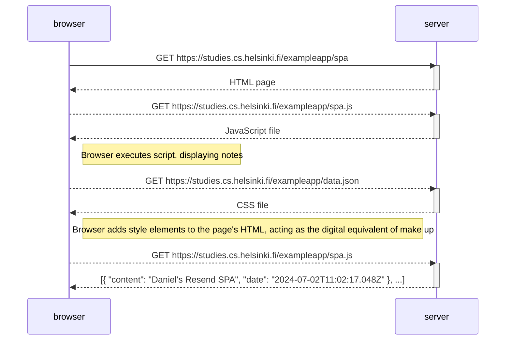

# SPA 'view page' use case diagram

```mermaid
sequenceDiagram
    participant browser
    participant server

    browser->>server: GET https://studies.cs.helsinki.fi/exampleapp/spa
    activate server
    server-->>browser: HTML page
    deactivate server

    browser -->> server: GET https://studies.cs.helsinki.fi/exampleapp/spa.js
    activate server
    server -->> browser: JavaScript file
    deactivate server

    note right of browser: Browser executes script, displaying notes

    browser -->> server: GET https://studies.cs.helsinki.fi/exampleapp/data.json
    activate server
    server -->> browser: CSS file
    deactivate server

    note right of browser: Browser adds style elements to the page's HTML, acting as the digital equivalent of make up

    browser -->> server: GET https://studies.cs.helsinki.fi/exampleapp/spa.js
    activate server
    server -->> browser: [{ "content": "Daniel's Resend SPA", "date": "2024-07-02T11:02:17.048Z" }, ...]
    deactivate server
```
