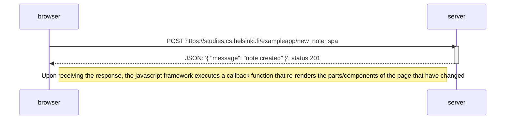

# SPA 'create note' use case diagram

```mermaid
sequenceDiagram
    participant browser
    participant server

    browser->>server: POST https://studies.cs.helsinki.fi/exampleapp/new_note_spa
    activate server
    server-->>browser: JSON: '{ "message": "note created" }', status 201
    deactivate server

    Note right of browser: Upon receiving the response, the javascript framework executes a callback function that re-renders the parts/components of the page that have changed
```
